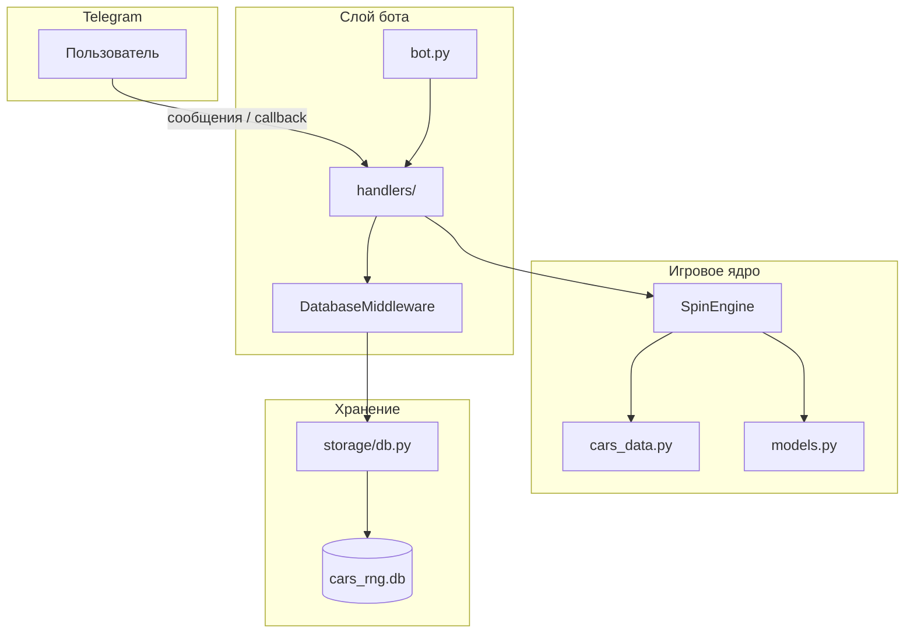
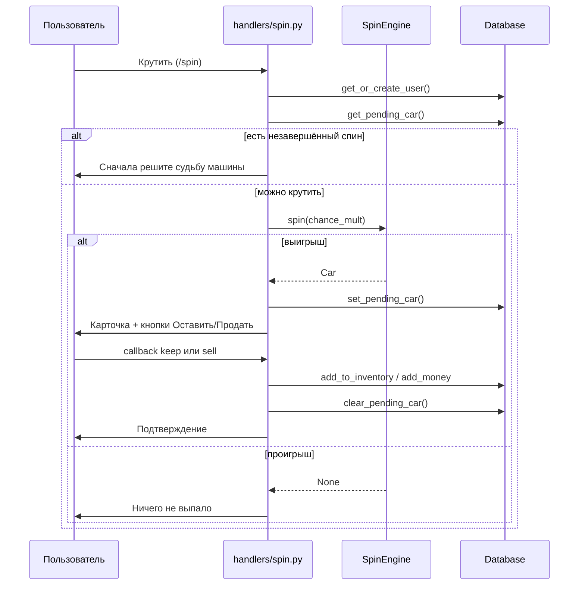

# CarRNG — Telegram-бот и консольная игра

Проект представляет собой RNG-игру (gacha) с коллекционированием автомобилей. Игрок крутит «колесо», выигрывает машины разной редкости и решает — оставить их в инвентаре или продать за игровую валюту.

Проект состоит из двух частей:

| Часть | Файл / папка | Описание |
|-------|--------------|----------|
| **Telegram-бот** | `bot.py`, `handlers/`, `game/`, `storage/` | Основной продукт. Мультипользовательский режим, SQLite |
| **Консольная версия** | `'CARS RNG.py` | Ранняя однопользовательская версия для терминала |

---

## Содержание

1. [Возможности](#возможности)
2. [Требования](#требования)
3. [Быстрый старт](#быстрый-старт)
4. [Структура проекта](#структура-проекта)
5. [Архитектура](#архитектура)
6. [Руководство пользователя](#руководство-пользователя)
7. [Игровая механика](#игровая-механика)
8. [База данных](#база-данных)
9. [Описание модулей](#описание-модулей)
10. [Конфигурация](#конфигурация)
11. [Консольная версия](#консольная-версия)
12. [Безопасность](#безопасность)
13. [Планы развития](#планы-развития)
14. [Устранение неполадок](#устранение-неполадок)

---

## Возможности

### Telegram-бот (MVP)

- **Спин** — один ролл за нажатие кнопки или команду `/spin`
- **Выбор после выигрыша** — inline-кнопки «Оставить» / «Продать за N»
- **Инвентарь** — просмотр собранных машин, лимит гаража, баланс
- **Сохранение прогресса** — данные каждого пользователя хранятся в SQLite
- **Блокировка повторного спина** — пока не решена судьба предыдущей машины, новый спин недоступен

### Консольная версия (расширенная)

- Автоспин, банк, улучшения, SE-события McLaren
- Работает независимо от Telegram-бота

---

## Требования

- **Python** 3.10+ (протестировано на 3.14)
- **Telegram-бот** — токен от [@BotFather](https://t.me/BotFather)
- **Интернет** — для polling Telegram API

### Зависимости

```
aiogram>=3.4
python-dotenv>=1.0
```

---

## Быстрый старт

### 1. Клонирование / переход в папку проекта

```powershell
cd "C:\Users\abqwe\OneDrive\Документы\CarRNGTelegramBot"
```

### 2. Установка зависимостей

```powershell
py -m pip install -r requirements.txt
```

### 3. Настройка токена

Создайте файл `.env` в корне проекта (можно скопировать из `.env.example`):

```env
BOT_TOKEN=ваш_токен_от_BotFather
```

### 4. Запуск бота

```powershell
py bot.py
```

При успешном запуске в консоли появится:

```
INFO:root:Бот запущен
INFO:aiogram.dispatcher:Start polling
INFO:aiogram.dispatcher:Run polling for bot @YourBot ...
```

### 5. Проверка в Telegram

1. Откройте бота в Telegram
2. Отправьте `/start`
3. Нажмите **Крутить** или **Инвентарь**

---

## Структура проекта

```
CarRNGTelegramBot/
│
├── bot.py                  # Точка входа Telegram-бота
├── config.py               # Загрузка BOT_TOKEN из .env
├── requirements.txt        # Python-зависимости
├── .env                    # Секреты (не коммитить!)
├── .env.example            # Шаблон переменных окружения
├── cars_rng.db             # SQLite-база (создаётся автоматически)
├── README.md               # Эта документация
│
├── game/                   # Игровая логика (общая для бота)
│   ├── models.py           # Dataclass: Car, Player
│   ├── cars_data.py        # База из 168 автомобилей
│   └── engine.py           # SpinEngine — RNG-логика спина
│
├── storage/                # Слой данных
│   └── db.py               # SQLite: users, inventory, pending_spins
│
├── handlers/               # Обработчики Telegram-событий
│   ├── keyboards.py        # Reply- и Inline-клавиатуры
│   ├── start.py            # /start
│   ├── spin.py             # Спин + callback keep/sell
│   └── inventory.py        # Просмотр инвентаря
│
└── 'CARS RNG.py             # Консольная версия (legacy)
```

---

## Архитектура



### Поток спина



### Принципы проектирования

- **Разделение слоёв** — Telegram-логика (`handlers/`) не знает деталей SQL; RNG (`game/`) не знает про Telegram
- **Один источник данных о машинах** — `game/cars_data.py` (168 записей)
- **Per-user state** — каждый `user_id` Telegram = отдельный игрок в БД
- **Middleware** — объект `Database` передаётся во все хендлеры через `DatabaseMiddleware`

---

## Руководство пользователя

### Команды

| Команда / кнопка | Действие |
|------------------|----------|
| `/start` | Регистрация, приветствие, главное меню |
| `/spin` или **Крутить** | Один спин |
| `/inventory` или **Инвентарь** | Список машин и баланс |

### После выигрыша

Появляются inline-кнопки:

| Кнопка | Действие |
|--------|----------|
| **Оставить** | Машина добавляется в инвентарь (если есть место) |
| **Продать за N** | Машина продаётся, `money` увеличивается на `N` |

### Ограничения

- **Лимит инвентаря** — по умолчанию 20 машин (`garage_cap`)
- **Pending spin** — нельзя крутить снова, пока не нажата «Оставить» или «Продать»
- **Проигрыш** — сообщение «Ничего не выпало», можно крутить сразу снова

---

## Игровая механика

### Модель автомобиля (`Car`)

| Поле | Тип | Описание |
|------|-----|----------|
| `name` | `str` | Название |
| `rarity` | `str` | Редкость |
| `value` | `int` | Стоимость продажи |
| `base_chance` | `float` | Базовый шанс выпадения |
| `points` | `int` | Очки (зарезервировано для будущих фич) |

### Редкости

| Редкость | Примерный диапазон шанса | Примеры |
|----------|--------------------------|---------|
| Обычный | 70–100 | LADA Granta, Toyota Camry |
| Необычный | 4–20 | Ford Mustang, Tesla Model 3 |
| Редкий | 0.3–0.9 | Porsche 911, Nissan GT-R |
| Эпический | 0.014–0.12 | McLaren F1, Bugatti Veyron |
| Легендарный | 0.0009–0.01 | Koenigsegg Jesko, Ferrari 330 P4 |
| Эксклюзивный | 0.07–0.4 | McLaren P1, Koenigsegg CCGT |

> **Эксклюзивные машины** (последние 9 в базе) **не участвуют** в обычном спине бота. Индекс выбирается из диапазона `0 .. len(cars) - 10`.

### Формула спина

Для каждого нажатия «Крутить»:

1. Случайно выбирается машина из пула (индекс `0 .. 158` при 168 машинах)
2. Вычисляется порог выигрыша:
   ```
   win_threshold = base_chance × 100_000 × chance_mult
   ```
3. Генерируется случайное число `roll` от `0` до `10_000_000`
4. Если `roll <= win_threshold` → выигрыш, иначе → проигрыш

**Пример:** машина с `base_chance = 100` и `chance_mult = 1.0`:
- `win_threshold = 10_000_000` → практически гарантированный выигрыш

**Пример:** машина с `base_chance = 0.01`:
- `win_threshold = 1_000` → шанс ≈ 0.01%

### Параметры игрока (`Player`)

| Поле | По умолчанию | Используется в боте |
|------|--------------|---------------------|
| `money` | `0` | Да — при продаже |
| `chance_mult` | `1.0` | Да — множитель шанса |
| `garage_cap` | `20` | Да — лимит инвентаря |

> Поля `chance_mult` и `garage_cap` заложены в БД для будущих улучшений. В MVP боте их нельзя изменить через интерфейс.

---

## База данных

Файл: `cars_rng.db` (SQLite, создаётся при первом запуске)

### Таблица `users`

| Колонка | Тип | Описание |
|---------|-----|----------|
| `user_id` | INTEGER PK | Telegram user ID |
| `money` | INTEGER | Баланс |
| `chance_mult` | REAL | Множитель шанса |
| `garage_cap` | INTEGER | Лимит инвентаря |

### Таблица `inventory`

| Колонка | Тип | Описание |
|---------|-----|----------|
| `id` | INTEGER PK | Автоинкремент |
| `user_id` | INTEGER FK | Владелец |
| `car_name` | TEXT | Название машины |
| `rarity` | TEXT | Редкость |
| `value` | INTEGER | Стоимость |
| `base_chance` | REAL | Шанс |
| `points` | INTEGER | Очки |

### Таблица `pending_spins`

Хранит машину, ожидающую решения игрока (оставить / продать).

| Колонка | Тип | Описание |
|---------|-----|----------|
| `user_id` | INTEGER PK | Один pending на пользователя |
| `car_name` | TEXT | ... |
| `rarity` | TEXT | ... |
| `value` | INTEGER | ... |
| `base_chance` | REAL | ... |
| `points` | INTEGER | ... |

### API класса `Database`

| Метод | Описание |
|-------|----------|
| `init()` | Создание таблиц |
| `get_or_create_user(user_id)` | Получить или создать игрока |
| `get_pending_car(user_id)` | Машина, ожидающая решения |
| `set_pending_car(user_id, car)` | Сохранить pending |
| `clear_pending_car(user_id)` | Удалить pending |
| `add_to_inventory(user_id, car)` | Добавить в инвентарь |
| `get_inventory(user_id)` | Список машин |
| `count_inventory(user_id)` | Количество машин |
| `add_money(user_id, amount)` | Начислить деньги, вернуть новый баланс |

---

## Описание модулей

### `bot.py`

- Создаёт `Database`, инициализирует схему
- Создаёт `Bot` и `Dispatcher` (aiogram 3)
- Подключает `DatabaseMiddleware` — передаёт `db` в каждый хендлер
- Регистрирует роутеры: `start`, `spin`, `inventory`
- Запускает long polling

### `config.py`

- Загружает `.env` через `python-dotenv`
- Читает `BOT_TOKEN`
- Выбрасывает `RuntimeError`, если токен не задан

### `game/engine.py` — `SpinEngine`

```python
engine = SpinEngine()
car = engine.spin(chance_mult=1.0)  # Car | None
```

- `EXCLUSIVE_POOL_SIZE = 9` — последние 9 машин исключены из пула
- Один вызов `spin()` = один ролл (в отличие от консоли, где до 100 попыток)

### `game/cars_data.py`

- `get_all_cars() -> list[Car]` — 168 автомобилей
- Единственный источник данных; изначально извлечён из `'CARS RNG.py`

### `handlers/spin.py`

| Обработчик | Триггер | Действие |
|------------|---------|----------|
| `spin_handler` | `/spin`, текст «Крутить» | Запуск спина |
| `keep_car` | callback `spin:keep` | Добавить в инвентарь |
| `sell_car` | callback `spin:sell` | Продать, начислить деньги |

### `handlers/inventory.py`

- Форматирует список машин с нумерацией
- Показывает `Машин: N / garage_cap` и `Баланс`

### `handlers/keyboards.py`

- `main_menu_keyboard()` — Reply-клавиатура (Крутить, Инвентарь)
- `spin_result_keyboard(value)` — Inline (Оставить, Продать)

---

## Конфигурация

### Переменные окружения

| Переменная | Обязательна | Описание |
|------------|-------------|----------|
| `BOT_TOKEN` | Да | Токен Telegram-бота |

### Файлы, которые не нужно коммитить в Git

```
.env
cars_rng.db
__pycache__/
*.pyc
```

### Рекомендуемый `.gitignore`

```gitignore
.env
cars_rng.db
__pycache__/
*.pyc
.venv/
```

---

## Консольная версия

Файл: `'CARS RNG.py`

Запуск:

```powershell
py "'CARS RNG.py"
```

### Команды консольной версии

| Команда | Действие |
|---------|----------|
| `s` | Крутить колесо |
| `as` | Автоспин |
| `g` | Показать гараж |
| `b` | Банк (обмен деньги ↔ токены) |
| `bu` | Купить улучшение шанса |
| `bs` | Купить место в гараже |
| `se1`, `se2` | Спецсобытия McLaren |
| `sp` | Список команд |

Консольная версия использует **глобальные переменные** и не связана с SQLite. Это отдельный режим для локальной игры / тестирования механик.

---

## Безопасность

1. **Никогда не публикуйте** `BOT_TOKEN` в открытом доступе (GitHub, чаты, скриншоты)
2. Файл `.env` должен быть только на сервере / локальной машине
3. При утечке токена — немедленно отзовите через [@BotFather](https://t.me/BotFather) → `/revoke`
4. Бот работает через **polling** — не требует открытого порта, но процесс должен быть запущен постоянно

---

## Планы развития

Идеи из исходного кода (ещё не реализованы в боте):

- [ ] SE-машины и SE-события (McLaren)
- [ ] Рынок (торговля между игроками)
- [ ] Донатные кейсы
- [ ] Лидерборд
- [ ] Инвентарь с кейсами
- [ ] Достижения
- [ ] Элементы из Top Drives
- [ ] Улучшения шанса и расширение гаража через бот
- [ ] Картинки машин при выигрыше
- [ ] Пагинация длинного инвентаря

---

## Устранение неполадок

### `RuntimeError: BOT_TOKEN не задан`

**Причина:** отсутствует или пустой файл `.env`

**Решение:**
```powershell
# Создайте .env в корне проекта
BOT_TOKEN=ваш_токен
```

### Бот не отвечает в Telegram

1. Проверьте, что `py bot.py` запущен и нет ошибок в консоли
2. Убедитесь, что токен актуален (не отозван)
3. Проверьте интернет-соединение
4. Убедитесь, что не запущено **два экземпляра** бота с одним токеном

### `ModuleNotFoundError: No module named 'aiogram'`

```powershell
py -m pip install -r requirements.txt
```

### «Сначала решите судьбу предыдущей машины»

Это штатное поведение. Нажмите **Оставить** или **Продать** на сообщении с последним выигрышем.

Если кнопки недоступны (сообщение удалено), очистите pending вручную:

```sql
DELETE FROM pending_spins WHERE user_id = ВАШ_TELEGRAM_ID;
```

### «Инвентарь полон»

Продавайте машины при спине или увеличьте `garage_cap` вручную в БД:

```sql
UPDATE users SET garage_cap = 50 WHERE user_id = ВАШ_TELEGRAM_ID;
```

### Остановка бота

В терминале, где запущен `py bot.py`, нажмите **Ctrl+C**.

---

## Лицензия и авторство

Проект создан в учебных / личных целях. База автомобилей вдохновлена механиками коллекционных авто-игр (Top Drives и аналоги).

---

## Краткая справка

```powershell
# Установка
py -m pip install -r requirements.txt

# Настройка
# Создать .env с BOT_TOKEN=...

# Запуск бота
py bot.py

# Запуск консольной версии
py "'CARS RNG.py"
```

**Бот:** [@CarRNG6543_bot](https://t.me/CarRNG6543_bot)